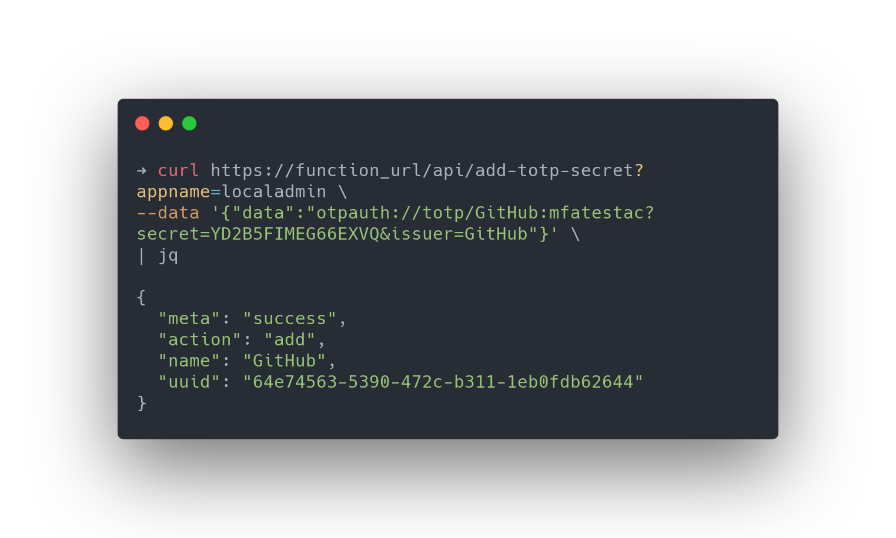
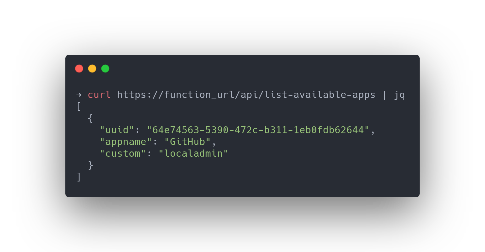
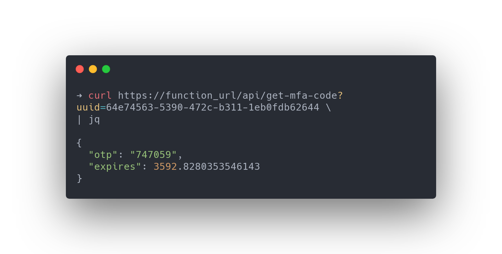

<!-- Shared MFA -->
<!-- josh.highet@theta.co.nz -->
<!-- test/development -->

***Shared MFA***

---

Sharing usernames and passwords is never a desired state, however a number of common services used by most organisations today still lack the ability to support multiple accounts.

This creates a burden when looking to adopt multi-factor authentication due to the challenges and complexities involved with sharing single-user-designed codes amongst a team.

This project aims to address these challenges by providing a serverless MFA implementation to support teams and organisations for the edge-cases we occasionally face. 

This has been built with Azure Functions, Table Storage, Azure Keyvault and Azure API Management. The core one-time PIN mechanism is supported by Python's [pyOTP Module](https://pyotp.readthedocs.io/en/latest/#)

## Technicals

This function exposes 3 endpoints, `/add-totp-secret`, `/get-mfa-code` & `/list-available-apps`. Each REST endpoint is described below.

## `add-totp-secret`

This endpoint takes a RFC spec OTP QR value as a JSON body, with a custom application name definde by a URL query paramater. Upon recieving a request, a UUID is created for the operation which is used to reference the secret for all future actions. The application name, UUID and custom attribute are added to Azure Table Storage. The OTP QR value is passed to Azure Keyvault, referenced by the UUID.

## `list-available-apps`

This endpoint will produce a JSON dictionary response with a list of UUID's and application names of stored within Table Storage.

## `get-mfa-code`

This endpoint is used to retrieve a code for a given application UUID. Upon recieving a UUID, the OTP value is retrieved from Key Vault, and the authentication code is generated and returned to the requestor with the time remaining on the current code.

---

# Local Runtime & Debugging

To run this project locally, [Azure Functions Core Tools](https://docs.microsoft.com/en-us/azure/azure-functions/functions-run-local?tabs=macos%2Ccsharp%2Cbash#install-the-azure-functions-core-tools) is required.

### Clone Repository

*Run the following command to populate application configuration strings*

> This will create an encrypted file, `local.settings.json` hosting runtime configurations for the Function , exposed as environment variables.

    func azure functionapp fetch-app-settings function_name_here

### Run the function

    func start --verbose

---
- 2020 <a href="https://www.theta.co.nz" target="_blank">Theta</a>.
