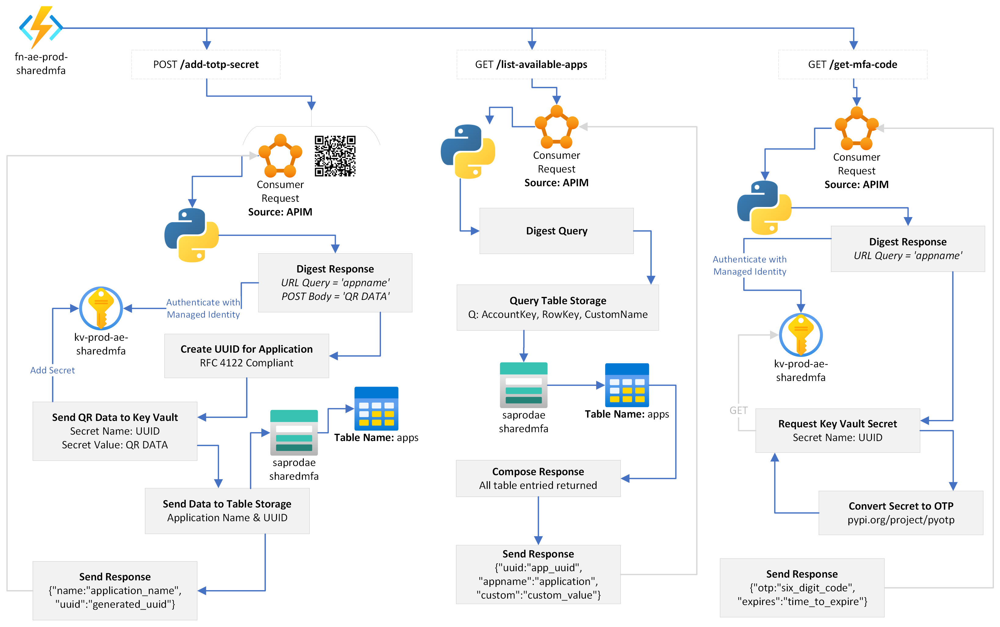

[](https://sonarcloud.io/dashboard?id=thetanz_sharedmfa)  

[](https://github.com/thetanz/sharedmfa/actions/workflows/fn-ae-sharedmfa-dev.yml)

<!-- production -->

# Shared MFA

Working with shared credentials with multi-factor authentication in the mix is no walk in the park. 

Like many, we subscribe to various SaaS platforms which for various reasons don't support the idea of multiple users. These platforms often provide the option to leverage MFA - and though technically achievable this wasn't always possible in practice.

If an application used in a shared context required a OTP, screenshots of QR codes were shared and ending up untracked. Whilst teams took to dedicated devices running an authenticator app - these quickly became a challenging feat to support with a remote workforce, not to mention the operational overhead.

sharedmfa provides a set of API's to support adding and generating one-time-pin codes programatically, outside the context of a classic device-led experience.

Looking for a frontend client with fine-grained permissions? [Drop us a line](https://theta.co.nz/cyber) to hear about our formal offerings.

## Overview

sharedmfa is an Azure based solution centric to Azure Functions, Table Storage & Key Vault.

The core OTP generation is handled by [pyOTP - The Python One-Time Password Library](https://pyauth.github.io/pyotp)

# Workflows



## Deployment

### Requirements

- [Python 3.7](https://www.python.org/downloads/)
- [Azure Functions Core Tools](https://docs.microsoft.com/en-us/azure/azure-functions/functions-run-local)
- [Azure CLI](https://docs.microsoft.com/en-us/cli/azure/install-azure-cli) or [Visual Studio Code](https://code.visualstudio.com)
- An Azure Subscription

```shell
git clone https://github.com/thetanz/sharedmfa.git
cd sharedmfa
```

### Azure Resources 

Prerequisites: _Azure Subscription, Resource Group, Key Vault & Storage Account_

Create a consumption-tier Function for us to deploy to with [`create-function-app-consumption.sh`](assets/create-function-app-consumption.sh)

Enable a System-Assigned Managed Identity for your Function App and grant it the **Key Vault Secrets Operator** role against the Key Vault

Fetch an encrypted copy of the application settings, replacing MY_FUNCTION_APP accordingly

```shell
func azure functionapp fetch-app-settings MY_FUNCTION_APP
```

Give the Functions context of your Key Vault by setting an environment variable, replacing MY_KEY_VAULT accordingly.

```shell
func settings add KEY_VAULT_NAME MY_KEY_VAULT
```

Create the required namespace within Table Storage, replacing MY_STORAGE_ACCOUNT accordingly

```shell
az storage table create --name apps --account-name MY_STORAGE_ACCOUNT
```

And deploy

```shell
func  azure functionapp publish MY_FUNCTION_APP --publish-local-settings
func azure functionapp list-functions MY_FUNCTION_APP
```

## Technicals

## `add-totp-secret`

this endpoint takes a RFC6238 spec seed along with an optional custom attribute which can be used for naming.

the application name, request UUID and custom attribute if specified are wrote to azure table storage.

the OTP seed is saved to azure keyvault, referenced by the UUID of the request.


## `list-available-apps`

this endpoint will respond with a list of application names and accomanying UUID's.


## `get-mfa-code`

this endpoint is used to retrieve a code for a given UUID - requests generate an authentication code, returning it with an accompanied validity duration value.


---
- 2021 <a href="https://www.theta.co.nz/cyber" target="_blank">Theta</a>.
